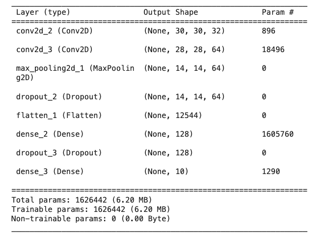
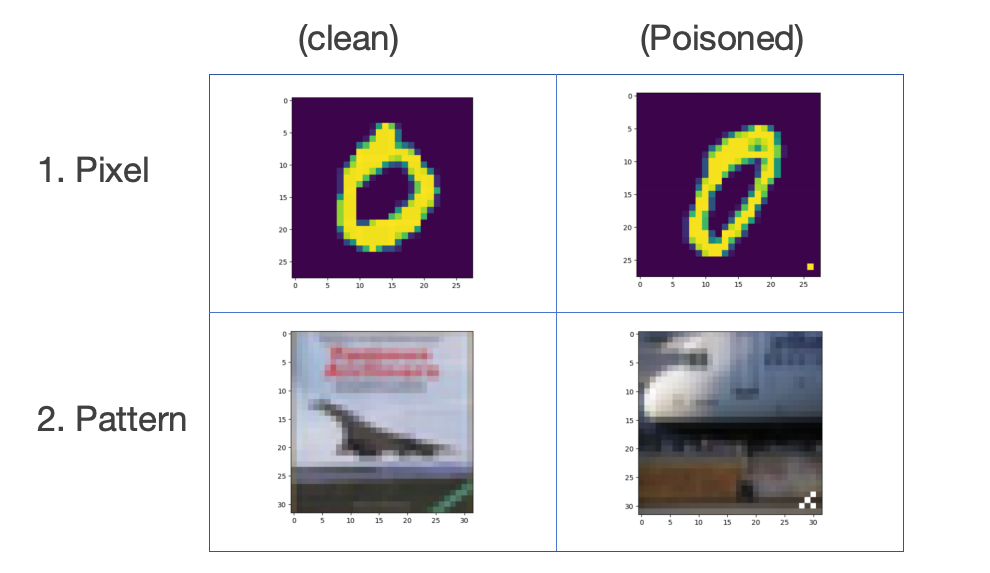

# Andy project log
### Key papers

[Label Poisoning is all you need](https://sepia-office-ba0.notion.site/Label-Poisoning-is-all-you-need-df6e4b24ce084c1280873e920c381289?pvs=4)

[Understanding Black-box Predictions via Influence Functions](https://sepia-office-ba0.notion.site/Understanding-Black-box-Predictions-via-Influence-Functions-71dd387ad24443ab95084b4e86239b1a?pvs=4)

[Spectral Signature (Feature Covariances)](https://sepia-office-ba0.notion.site/Spectral-Signature-Feature-Covariances-856d95dc9261462abbc11c9a21deb58c?pvs=4)

[Activation Clustering](https://sepia-office-ba0.notion.site/Activation-Clustering-8020ed9f112d4d9380a30f7ee18680fc?pvs=4)

[Selective Synaptic Dampening (SSD)](https://sepia-office-ba0.notion.site/Selective-Synaptic-Dampening-SSD-9316d98b8c0e4b979a2ba2ca57e11a31?pvs=4)

[Corrective Machine Unlearning](https://sepia-office-ba0.notion.site/Corrective-Machine-Unlearning-66b0445e86d3489cb21c058e143be52e?pvs=4)

### Related papers

[Rethinking Machine Unlearning for LLM](https://sepia-office-ba0.notion.site/Rethinking-Machine-Unlearning-for-LLM-248d806ae4cd45109fb2fb4e7790d79a?pvs=4)

---

### Weekly Todos:

1️⃣ 

[X] read the rethinking paper

[/] play around with the code for feature covariances

[X] read the label poisoning paper

2️⃣

~~[Cancelled] finishing the baseline of feature coraviance~~ -> handed over to Saiteja

[X] finish activating clustering 

[/] check the influence function implementation

---

### Current Poison Setup
For activation clustering, the <u>datasets</u> I'm using are:  
1. **MNIST**: 7,500 training images and 10,000 test images
2. **CIFAR-10**: 50,000 training images and 10,000 test images. 

The <u>model</u> is basic Keras CNN:

The <u>poison methods</u> are:  

The poison strategy is to form "one shift" mapping:  
i.e. for original mappings (source to target): **0->0, 1->1, ..., 9->9**   
The poisoned mappings are: **0->1, 1->2, ..., 9->0**  

About the size to poison: 
I used 1% and 33% poison rate for both MNIST and CIFAR10.

<u>*Click below to get more results.*</u>

[More details...](https://sepia-office-ba0.notion.site/details-deeeab429806452a809e7f045c67a0af?pvs=4)

